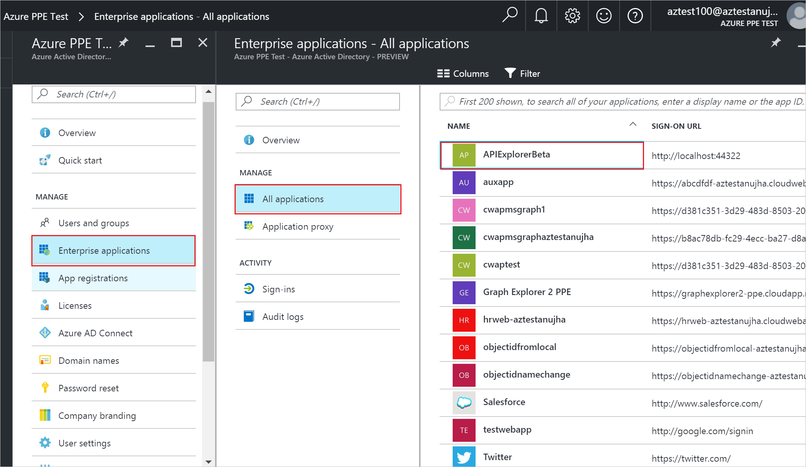

# Assign a user or group to an enterprise app in Azure Active Directory preview
It's easy to assign a user or a group to your enterprise applications in Azure Active Directory (Azure AD) preview. [What's in the preview?](active-directory-preview-explainer.md) You must have the appropriate permissions to manage the enterprise app. In the current preview, you must be global admin for the directory.

## How do I assign user access to an enterprise app?
1. Sign in to the [Azure portal](https://portal.azure.com) with an account that's a global admin for the directory.
2. Select **More services**, enter Azure Active Directory in the text box, and then select **Enter**.
3. On the **Azure Active Directory - *directoryname*** blade (that is, the Azure AD blade for the directory you are managing), select **Enterprise applications**.
   
   
4. On the **Enterprise applications** blade, select **All applications**. You'll see a list of the apps you can manage.
5. On the **Enterprise applications - All applications** blade, select an app.
6. On the ***appname*** blade (that is, the blade with the name of the selected app in the title), select **Users & Groups**.
   
   
7. On the ***appname*** **- User & Group Assignment** blade, select the **Add** command.
8. On the **Add Assignment** blade, select **Users and groups**.
   
   
9. On the **Users and groups** blade, select one or more users or groups from the list and then select the **Select** button at the bottom of the blade.
10. On the **Add Assignment** blade, select **Role**. Then, on the **Select Role** blade, select a role to apply to the selected users or groups, and then select the **OK** button at the bottom of the blade.
11. On the **Add Assignment** blade, select the **Assign** button at the bottom of the blade. The assigned users or groups will have the permissions defined by the selected role for this enterprise app.

## Next steps
* [See all of my groups](active-directory-groups-view-azure-portal.md)
* [Remove a user or group assignment from an enterprise app](active-directory-coreapps-remove-assignment-user-azure-portal.md)
* [Disable user sign-ins for an enterprise app](active-directory-coreapps-disable-app-azure-portal.md)
* [Change the name or logo of an enterprise app](active-directory-coreapps-change-app-logo-azure-portal.md)

