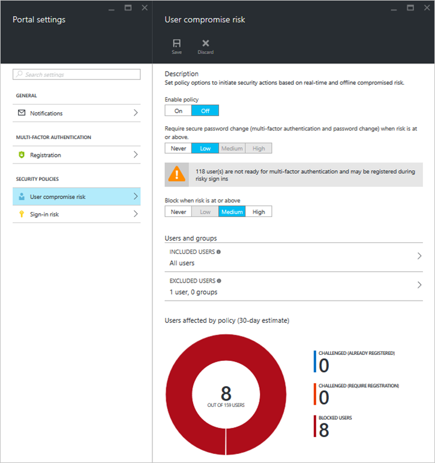
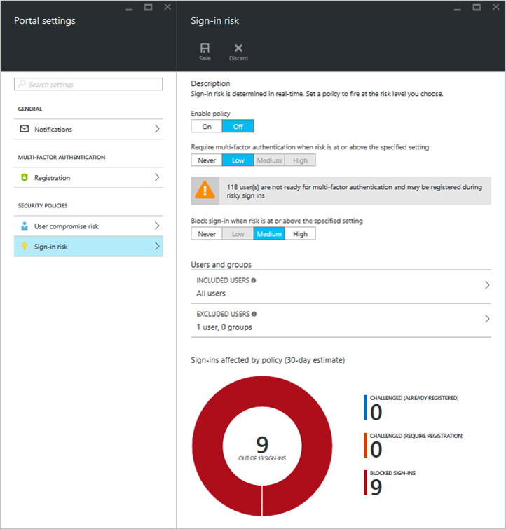

# Azure Active Directory Identity Protection playbook
This playbook helps you to:

* Populate data in the Identity Protection environment by simulating risk events and vulnerabilities
* Set up risk-based conditional access policies and test the impact of these policies

## Simulating Risk Events
This section provides you with steps for simulating the following risk event types:

* Sign-ins from anonymous IP addresses (easy)
* Sign-ins from unfamiliar locations (moderate)
* Impossible travel to atypical locations (difficult)

Other risk events cannot be simulated in a secure manner.

### Sign-ins from anonymous IP addresses
This risk event type identifies users who have successfully signed in from an IP address that has been identified as an anonymous proxy IP address. These proxies are used by people who want to hide their device’s IP address and may be used for malicious intent.

**To simulate a sign-in from an anonymous IP, perform the following steps**:

1. Download the [Tor Browser](https://www.torproject.org/projects/torbrowser.html.en).
2. Using the Tor Browser, navigate to [https://myapps.microsoft.com](https://myapps.microsoft.com).   
3. Enter the credentials of the account you want to appear in the **Sign-ins from anonymous IP addresses** report.

The sign-in will show up on the Identity Protection dashboard within 5 minutes. 

### Sign-ins from unfamiliar locations
The unfamiliar locations risk is a real-time sign-in evaluation mechanism that considers past sign-in locations (IP, Latitude / Longitude and ASN) to determine new / unfamiliar locations. The system stores previous IPs, Latitude / Longitude, and ASNs of a user and considers these to be familiar locations. A sign-in location is considered unfamiliar if the sign-in location does not match any of the existing familiar locations.

Azure Active Directory Identity Protection:  

* has an initial learning period of 14 days during which it does not flag any new locations as unfamiliar locations.
* ignores sign-ins from familiar devices and locations that are geographically close to an existing familiar location.

To simulate unfamiliar locations, you have to sign in from a location and device that the account has not signed in from before. 

**To simulate a sign-in from an unfamiliar location, perform the following steps**:

1. Choose an account that has at least a 14-day sign-in history. 
2. Do either:
   
   a. While using a VPN, navigate to [https://myapps.microsoft.com](https://myapps.microsoft.com) and enter the credentials of the account you want to simulate the risk event for.
   
   b. Ask an associate in a different location to sign in using the account’s credentials (not recommended).

The sign-in will show up on the Identity Protection dashboard within 5 minutes.

### Impossible travel to atypical location
Simulating the impossible travel condition is difficult because the algorithm uses machine learning to weed out false-positives such as impossible travel from familiar devices, or sign-ins from VPNs that are used by other users in the directory. Additionally, the algorithm requires a sign-in history of 3 to 14 days for the user before it begins generating risk events.

**To simulate an impossible travel to atypical location, perform the following steps**:

1. Using your standard browser, navigate to [https://myapps.microsoft.com](https://myapps.microsoft.com).  
2. Enter the credentials of the account you want to generate an impossible travel risk event for.
3. Change your user agent. You can change user agent in Internet Explorer from Developer Tools, or change your user agent in Firefox or Chrome using a user-agent switcher add-on.
4. Change your IP address. You can change your IP address by using a VPN, a Tor add-on, or spinning up a new machine in Azure in a different data center.
5. Sign-in to [https://myapps.microsoft.com](https://myapps.microsoft.com) using the same credentials as before and within a few minutes after the previous sign-in.

The sign-in will show up in the Identity Protection dashboard within 2-4 hours. 
Because of the complex machine learning models involved, there is a chance it will not get picked up.  
You might want to replicate these steps for multiple Azure AD accounts.

## Simulating vulnerabilities
Vulnerabilities are weaknesses in an Azure AD environment that can be exploited by a bad actor. Currently 3 types of vulnerabilities are surfaced in Azure AD Identity Protection that leverage other features of Azure AD. These Vulnerabilities will be displayed on the Identity Protection dashboard automatically once these features are set up.

* Azure AD [Multi-Factor Authentication?](../multi-factor-authentication/multi-factor-authentication.md)
* Azure AD [Cloud App Discovery](active-directory-cloudappdiscovery-whatis.md).
* Azure AD [Privileged Identity Management](active-directory-privileged-identity-management-configure.md). 

## User compromise risk
**To test User compromise risk, perform the following steps**:

1. Sign-in to [https://portal.azure.com](https://portal.azure.com) with global administrator credentials for your tenant.
2. Navigate to **Identity Protection**. 
3. On the main **Azure AD Identity Protection** blade, click **Settings**. 
4. On the **Portal Settings** blade, under **Security rules**, click **User compromise risk**. 
5. On the **Sign in Risk** blade, turn **Enable rule** off, and then click **Save** settings.
6. For a given user account, simulate an unfamiliar locations or anonymous IP risk event. This will elevate the user risk level for that user to **Medium**.
7. Wait a few minutes, and then verify that user level for your user is **Medium**.
8. Go to the **Portal Settings** blade.
9. On the **User Compromise Risk** blade, under **Enable rule**, select **On** . 
10. Select one of the following options:
    
    a. To block, select **Medium** under **Block sign in**.
    
    b. To enforce secure password change, select **Medium** under **Require multi-factor authentication**.
11. Click **Save**.
12. You can now test risk-based conditional access by signing in using a user with an elevated risk level. If the user risk is Medium, depending on the configuration of your policy, your sign-in is be either blocked or you are forced to change your password. 
      
    
     

## Sign-in risk
**To test a sign in risk, perform the following steps:**

1. Sign-in to [https://portal.azure.com ](https://portal.azure.com) with global administrator credentials for your tenant.
2. Navigate to **Identity Protection**.
3. On the main **Azure AD Identity Protection** blade, click **Settings**. 
4. On the **Portal Settings** blade, under **Security rules**, click **Sign in risk**.
5. On the **Sign in Risk **blade, select **On** under **Enable rule**. 
6. Select one of the following options:
   
   a. To block, select **Medium** under **Block sign in**
   
   b. To enforce secure password change, select **Medium** under **Require multi-factor authentication**.
7. To block, select Medium under Block sign in.
8. To enforce multi-factor authentication, select **Medium** under **Require multi-factor authentication**.
9. Click on **Save**.
10. You can now test risk-based conditional access by simulating the unfamiliar locations or anonymous IP risk events because they are both **Medium** risk events.

 

 

## See also
* [Azure Active Directory Identity Protection](active-directory-identityprotection.md)

