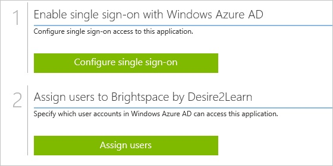
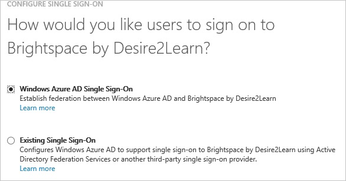
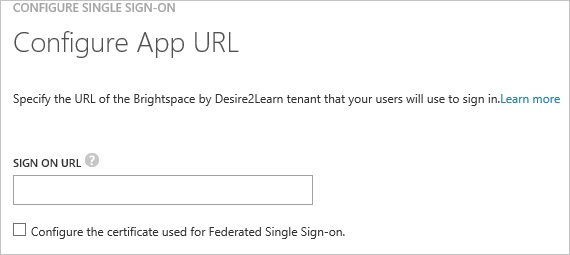
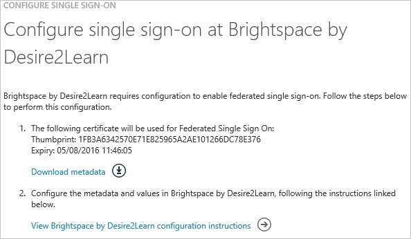
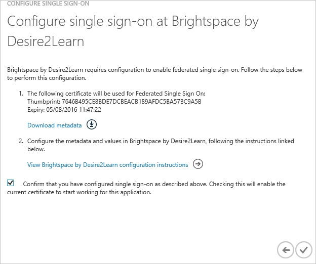

# Tutorial: Azure Active Directory integration with Brightspace by Desire2Learn
The objective of this tutorial is to show the integration of Azure and Brightspace by Desire2Learn.  
The scenario outlined in this tutorial assumes that you already have the following items:

* A valid Azure subscription
* A Brightspace by Desire2Learn single sign-on enabled subscription

After completing this tutorial, the Azure AD users you have assigned to Brightspace by Desire2Learn will be able to single sign into the application at your Brightspace by Desire2Learn company site (service provider initiated sign on), or using the [Introduction to the Access Panel](active-directory-saas-access-panel-introduction.md).

The scenario outlined in this tutorial consists of the following building blocks:

1. Enabling the application integration for Brightspace by Desire2Learn
2. Configuring single sign-on
3. Configuring user provisioning
4. Assigning users

## Enabling the application integration for Brightspace by Desire2Learn
The objective of this section is to outline how to enable the application integration for Brightspace by Desire2Learn.

### To enable the application integration for Brightspace by Desire2Learn, perform the following steps:
1. In the Azure classic portal, on the left navigation pane, click **Active Directory**.
   
   
2. From the **Directory** list, select the directory for which you want to enable directory integration.
3. To open the applications view, in the directory view, click **Applications** in the top menu.
   
   
4. Click **Add** at the bottom of the page.
   
   
5. On the **What do you want to do** dialog, click **Add an application from the gallery**.
   
   
6. In the **search box**, type **Brightspace by Desire2Learn**.
   
   
7. In the results pane, select **Brightspace by Desire2Learn**, and then click **Complete** to add the application.
   
   
   
   ## Configuring single sign-on

The objective of this section is to outline how to enable users to authenticate to Brightspace by Desire2Learn with their account in Azure AD using federation based on the SAML protocol.

### To configure single sign-on, perform the following steps:
1. In the Azure classic portal, on the **Brightspace by Desire2Learn** application integration page, click **Configure single sign-on** to open the **Configure Single Sign On ** dialog.
   
   
2. On the **How would you like users to sign on to Brightspace by Desire2Learn** page, select **Microsoft Azure AD Single Sign-On**, and then click **Next**.
   
   
3. On the **Configure App URL** page, perform the following steps:
   
   
   
   1. In the **Sign On URL** textbox, type the URL used by your users to sign into your **Brightspace by Desire2Learn** (e.g.: *https://partnershowcase.desire2learn.com/Shibboleth.sso/Login?entityID=https://sts.windows-ppe.net/5caf9349-fd93-4a74-b064-0070f65bfb49/&target=https%3A%2F%2Fpartnershowcase.desire2learn.com%2Fd2l%2FshibbolethSSO%2Faspinfo.asp*).
   2. Click **Next**
4. On the **Configure single sign-on at Brightspace by Desire2Learn** page, to download your metadata, click **Download metadata**, and then save the metadata on your computer.
   
   
5. Send the downloaded metadata file to your Brightspace by Desire2Learn support team.
   
   > [!NOTE]
   > Your Brightspace by Desire2Learn support team has to do the actual SSO configuration.
   > You will get a notification when SSO has been enabled for your subscription.
   > 
   > 
6. On the Azure classic portal, select the single sign-on configuration confirmation, and then click **Complete** to close the **Configure Single Sign On** dialog.
   
   
   
   ## Configuring user provisioning

In order to enable Azure AD users to log into Brightspace by Desire2Learn, they must be provisioned into Brightspace by Desire2Learn.  
In the case of Brightspace by Desire2Learn, the user accounts need to be created by your Brightspace by Desire2Learn support team.

> [!NOTE]
> You can use any other Brightspace by Desire2Learn user account creation tools or APIs provided by Brightspace by Desire2Learn to provision Azure Active Directory user accounts.
> 
> 

## Assigning users
To test your configuration, you need to grant the Azure AD users you want to allow using your application access to it by assigning them.

### To assign users to Brightspace by Desire2Learn, perform the following steps:
1. In the Azure classic portal, create a test account.
2. On the **Brightspace by Desire2Learn **application integration page, click **Assign users**.
   
   
3. Select your test user, click **Assign**, and then click **Yes** to confirm your assignment.
   
   

If you want to test your single sign-on settings, open the Access Panel. For more details about the Access Panel, see [Introduction to the Access Panel](active-directory-saas-access-panel-introduction.md).

