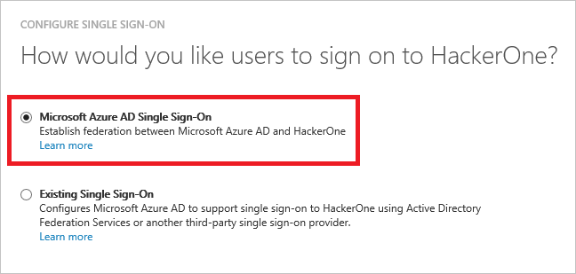
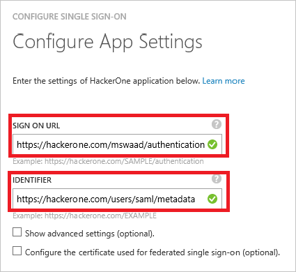
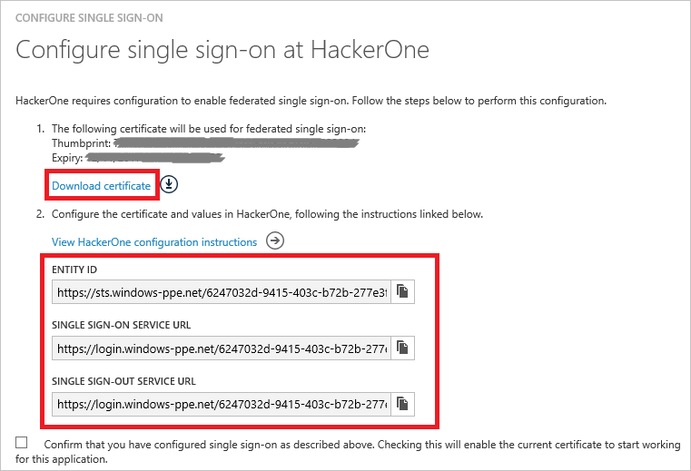
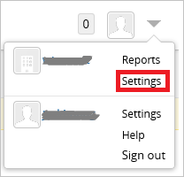
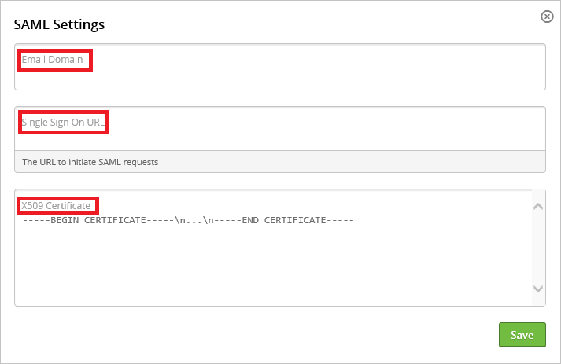
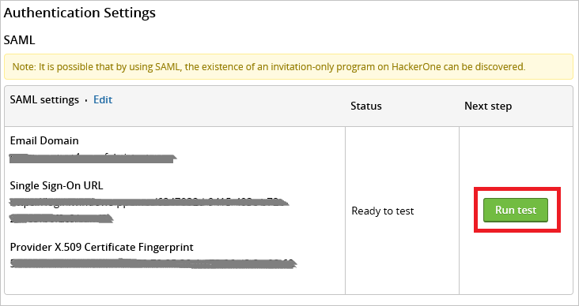

# Tutorial: Azure Active Directory integration with HackerOne
In this tutorial, you integrate HackerOne with Azure Active Directory (Azure AD).

Integrating HackerOne with Azure AD provides you with the following benefits:

* You can control in Azure AD who has access to HackerOne
* You can enable your users to automatically get signed-on to HackerOne (Single Sign-On) with their Azure AD accounts
* You can manage your accounts in one central location - the Azure classic portal

If you want to know more details about SaaS app integration with Azure AD, see [What is application access and single sign-on with Azure Active Directory](active-directory-appssoaccess-whatis.md).

## Prerequisites
To configure Azure AD integration with HackerOne, you need the following items:

* An Azure subscription
* A HackerOne single-sign on enabled subscription

> [!NOTE]
> To test the steps in this tutorial, we do not recommend using a production environment.
> 
> 

To test the steps in this tutorial, you should follow these recommendations:

* You should not use your production environment, unless this is necessary.
* If you don't have an Azure AD trial environment, you can get a one-month trial [here](https://azure.microsoft.com/pricing/free-trial/).

## Scenario Description
In this tutorial, you configure and test Azure AD single sign-on in a test environment.  
The scenario outlined in this tutorial consists of two main building blocks:

1. Adding HackerOne from the gallery
2. Configuring and testing Azure AD single sign-on

## Adding HackerOne from the gallery
To integrate HackerOne into Azure AD, you need to add HackerOne from the gallery to your list of managed SaaS apps.

**To add HackerOne from the gallery, perform the following steps:**

1. In the **Azure classic portal**, on the left navigation pane, click **Active Directory**. 
   
    ![Active Directory][1]
2. From the **Directory** list, select the directory for which you want to enable directory integration.
3. To open the applications view, in the directory view, click **Applications** in the top menu.
   
    ![Applications][2]
4. Click **Add** at the bottom of the page.
   
    ![Applications][3]
5. On the **What do you want to do** dialog, click **Add an application from the gallery**.

![Applications][4]

1. In the search box, type **HackerOne**.

1. In the results pane, select **HackerOne**, and then click **Complete** to add the application.

## Configuring and testing Azure AD single sign-on
Next, you configure and test Azure AD single sign-on with HackerOne based on a test user called "Britta Simon".

For single sign-on to work, Azure AD needs to know what the counterpart user in HackerOne to an user in Azure AD is. In other words, a link relationship between an Azure AD user and the related user in HackerOne needs to be established.  
This link relationship is established by assigning the value of the **user name** in Azure AD as the value of the **Username** in HackerOne.

To configure and test Azure AD single sign-on with HackerOne, you need to complete the following building blocks:

1. **[Configuring Azure AD Single Sign-On](#configuring-azure-ad-single-single-sign-on)** - to enable your users to use this feature.
2. **[Creating an Azure AD test user](#creating-an-azure-ad-test-user)** - to test Azure AD single sign-on with Britta Simon.
3. **[Creating a HackerOne test user](#creating-a-hackerone-test-user)** - to have a counterpart of Britta Simon in Certify that is linked to the Azure AD representation of her.
4. **[Assigning the Azure AD test user](#assigning-the-azure-ad-test-user)** - to enable Britta Simon to use Azure AD single sign-on.
5. **[Testing Single Sign-On](#testing-single-sign-on)** - to verify whether the configuration works.

### Configuring Azure AD Single Sign-On
Next, you enable Azure AD single sign-on in the classic portal and to configure single sign-on in your HackerOne application.

As part of this procedure, you are required to create a base-64 encoded certificate file.  
If you are not familiar with this procedure, see [How to convert a binary certificate into a text file](http://youtu.be/PlgrzUZ-Y1o).

**To configure Azure AD single sign-on with HackerOne, perform the following steps:**

1. In the Azure classic portal, on the **HackerOne** application integration page, click **Configure single sign-on** to open the **Configure Single Sign-On**  dialog.
   
    ![Configure Single Sign-On][6] 
2. On the **How would you like users to sign on to HackerOne** page, select **Azure AD Single Sign-On**, and then click **Next**.
   
     
3. On the **Configure App Settings** dialog page, perform the following steps and then click **Next**:
   
     

    a. In the **Sign On URL** textbox, type the URL used by your users to sign-on to your HackerOne application using the following pattern: **“https://hackerone.com/\<company name\>/authentication”**. 

    b. Contact the HackerOne support team via [support@hackerone.com](mailto:support@hackerone.com) to get your tenant URL if you don't know it.

    c. In the **Identifier** textbox, type the tenant URL. 

    d. Click **Next**.

1. On the **Configure single sign-on at HackerOne** page, perform the following steps and then click **Next**:
   
     
   
    a. Click **Download certificate**, and then save the file on your computer.
   
    b. Click **Next**.
2. Sign-on to your HackerOne tenant as an administrator.
3. In the menu on the top, click the **Settings**.
   
     
4. Navigate to "**Authentication**" and click "**Add SAML settings**".
   
     
5. On the **SAML Settings** dialog, perform the following steps:
   
     
   
    a. In the **Email Domain** textbox, type a registered domain.
   
    b. On the Azure classic portal, copy the **Single Sign-On Service URL**, and then paste it into the Single Sign On URL textbox.
   
    c. Create a **base-64 encoded** file from your downloaded certificate.  
   
       >[AZURE.TIP] For more details, see [How to convert a binary certificate into a text file](http://youtu.be/PlgrzUZ-Y1o)
   
    d. Open your base-64 encoded certificate in notepad, copy the content of it into your clipboard, and then paste it to the **X509 Certificate** textbox.
   
    e. Click the **Save**
6. On the Authentication Settings dialog, perform the following steps:
   
     
   
    a. Click **Run test**.
   
    b. If the value of the **Status** field equals **Last test status: created**, contact your HackerOne support team via [support@hackerone.com](mailto:support@hackerone.com) to request a review of your configuration.
7. In the Azure classic portal, select the single sign-on configuration confirmation, and then click **Next**.
   
    ![Azure AD Single Sign-On][10]
8. On the **Single sign-on confirmation** page, click **Complete**.  
   
    ![Azure AD Single Sign-On][11]

### Creating an Azure AD test user
Next, you create a test user in the classic portal called Britta Simon.  

![Create Azure AD User][20]

**To create a SECURE DELIVER test user in Azure AD, perform the following steps:**

1. In the **Azure classic portal**, on the left navigation pane, click **Active Directory**.
   
     
2. From the **Directory** list, select the directory for which you want to enable directory integration.
3. To display the list of users, in the menu on the top, click **Users**.
   
     
4. To open the **Add User** dialog, in the toolbar on the bottom, click **Add User**.
     
5. On the **Tell us about this user** dialog page, perform the following steps:
   
     
   
    a. As Type Of User, select New user in your organization.
   
    b. In the User Name **textbox**, type **BrittaSimon**.
   
    c. Click **Next**.
6. On the **User Profile** dialog page, perform the following steps:
   
    
   
   a. In the **First Name** textbox, type **Britta**.  
   
   b. In the **Last Name** textbox, type, **Simon**.
   
   c. In the **Display Name** textbox, type **Britta Simon**.
   
   d. In the **Role** list, select **User**.
   
   e. Click **Next**.
7. On the **Get temporary password** dialog page, click **create**.
   
     
8. On the **Get temporary password** dialog page, perform the following steps:
   
     
   
    a. Write down the value of the **New Password**.
   
    b. Click **Complete**.   

### Creating a HackerOne test user
Next, you create a user called Britta Simon in HackerOne. HackerOne supports just-in-time provisioning, which is enabled by default.

There is no action item for you in this section. When you access HackerOne, a new user is created if it doesn't exist yet. [Configuring Azure AD Single Sign-On](#configuring-azure-ad-single-single-sign-on).

> [!NOTE]
> If you need to create a user manually, you need to contact the Certify support team.
> 
> 

### Assigning the Azure AD test user
Next, you enable Britta Simon to use Azure single sign-on by granting her access to HackerOne.

![Assign User][200] 

**To assign Britta Simon to HackerOne, perform the following steps:**

1. On the Azure classic portal, to open the applications view, in the directory view, click **Applications** in the top menu.
   
    ![Assign User][201] 
2. In the applications list, select **HackerOne**.
   
     
3. In the menu on the top, click **Users**.
   
    ![Assign User][203] 
4. In the Users list, select **Britta Simon**.
5. In the toolbar on the bottom, click **Assign**.
   
    ![Assign User][205]

### Testing Single Sign-On
Finally, you test your Azure AD single sign-on configuration using the Access Panel.  
When you click the HackerOne tile in the Access Panel, you should get automatically signed-on to your HackerOne application.

## Additional Resources
* [List of Tutorials on How to Integrate SaaS Apps with Azure Active Directory](active-directory-saas-tutorial-list.md)
* [What is application access and single sign-on with Azure Active Directory?](active-directory-appssoaccess-whatis.md)

<!--Image references-->

[1]: ./media/active-directory-saas-hackerone-tutorial/tutorial_general_01.png
[2]: ./media/active-directory-saas-hackerone-tutorial/tutorial_general_02.png
[3]: ./media/active-directory-saas-hackerone-tutorial/tutorial_general_03.png
[4]: ./media/active-directory-saas-hackerone-tutorial/tutorial_general_04.png

[6]: ./media/active-directory-saas-hackerone-tutorial/tutorial_general_05.png
[10]: ./media/active-directory-saas-hackerone-tutorial/tutorial_general_06.png
[11]: ./media/active-directory-saas-hackerone-tutorial/tutorial_general_07.png
[20]: ./media/active-directory-saas-hackerone-tutorial/tutorial_general_100.png

[200]: ./media/active-directory-saas-hackerone-tutorial/tutorial_general_200.png
[201]: ./media/active-directory-saas-hackerone-tutorial/tutorial_general_201.png
[203]: ./media/active-directory-saas-hackerone-tutorial/tutorial_general_203.png
[204]: ./media/active-directory-saas-hackerone-tutorial/tutorial_general_204.png
[205]: ./media/active-directory-saas-hackerone-tutorial/tutorial_general_205.png