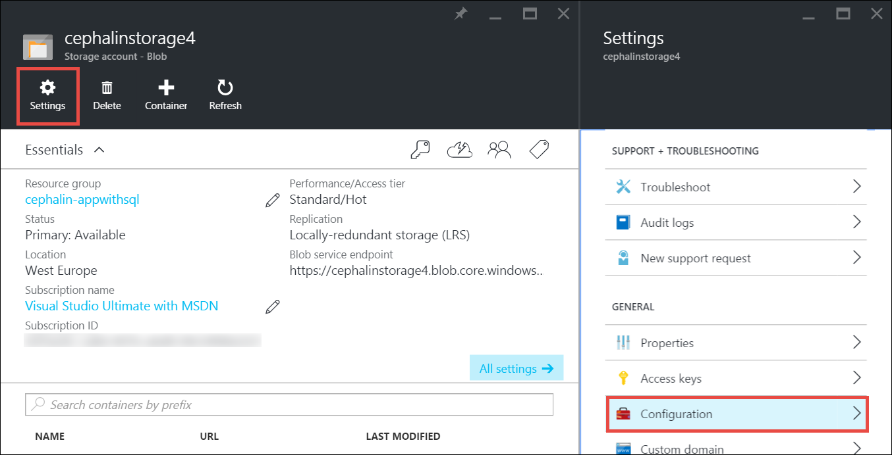

# Scale up an app in Azure
This article shows you how to scale your app in Azure App Service. There are two workflows for scaling, scale up and scale out, and this article explains the scale up workflow.

* [Scale up](https://en.wikipedia.org/wiki/Scalability#Horizontal_and_vertical_scaling): Get more CPU, memory, disk space, and extra features
  like dedicated virtual machines (VMs), custom domains and certificates, staging slots, autoscaling, and more. You scale up by changing the pricing tier of the
  App Service plan that your app belongs to.
* [Scale out](https://en.wikipedia.org/wiki/Scalability#Horizontal_and_vertical_scaling): Increase the number of VM instances that run your app.
  You can scale out to as many as 20 instances, depending on your pricing tier. [App Service Environments](../app-service/app-service-app-service-environments-readme.md)
  in **Premium** tier will further increase your scale-out count to 50 instances. For more information about scaling out, see
  [Scale instance count manually or automatically](../azure-portal/insights-how-to-scale.md). There you will find out how
  to use autoscaling, which is to scale instance count automatically based on predefined rules and schedules.

The scale settings take only seconds to apply and affect all apps in your [App Service plan](../app-service/azure-web-sites-web-hosting-plans-in-depth-overview.md).
They do not require you to change your code or redeploy your application.

For information about the pricing and features of individual App Service plans, see [App Service Pricing Details](/pricing/details/web-sites/).  

> [!NOTE]
> Before you switch an App Service plan from the **Free** tier, you must first remove the [spending limits](/pricing/spending-limits/) in place for your Azure subscription. To view or change options for your Microsoft Azure App Service subscription, see [Microsoft Azure Subscriptions][azuresubscriptions].
> 
> 

## Scale up your pricing tier
1. In your browser, open the [Azure portal][portal].
2. In your app's blade, click **All settings**, and then click **Scale Up**.
   
    ![Navigate to scale up your Azure app.][ChooseWHP]
3. Choose your tier, and then click **Select**.
   
    The **Notifications** tab will flash a green **SUCCESS** after the operation is complete.

## Scale related resources
If your app depends on other services, such as Azure SQL Database or Azure Storage, you can also scale up those resources
based on your needs. These resources are not scaled with the App Service plan and must be scaled separately.

1. In **Essentials**, click the **Resource group** link.
   
    
2. In the **Summary** part of the **Resource group** blade, click a resource that you want to scale. The following screenshot
   shows a SQL Database resource and an Azure Storage resource.
   
    
3. For a SQL Database resource, click **Settings** > **Pricing tier** to scale the pricing tier.
   
    
   
    You can also turn on [geo-replication](../sql-database/sql-database-geo-replication-overview.md) for your SQL Database instance.
   
    For an Azure Storage resource, click **Settings** > **Configuration** to scale up your storage options.
   
    

## Learn about developer features
Depending on the pricing tier, the following developer-oriented features are available:

### Bitness
* The **Basic**, **Standard**, and **Premium** tiers support 64-bit and 32-bit applications.
* The **Free** and **Shared** plan tiers support 32-bit applications only.

### Debugger support
* Debugger support is available for the **Free**, **Shared**, and **Basic** modes at one connection per App Service plan.
* Debugger support is available for the **Standard** and **Premium** modes at five concurrent connections per App Service plan.

## Learn about other features
* For detailed information about all of the remaining features in the App Service plans, including pricing and features of interest to all users (including developers), see [App Service Pricing Details](/pricing/details/web-sites/).

> [!NOTE]
> If you want to get started with Azure App Service before you sign up for an Azure account, go to [Try App Service](http://go.microsoft.com/fwlink/?LinkId=523751) where you can immediately create a short-lived starter web app in App Service. No credit cards are required and there are no commitments.
> 
> 

## Next steps
* To get started with Azure, see [Microsoft Azure Free Trial](/pricing/free-trial/).
* For information about pricing, support, and SLA, visit the following links.
  
    [Data Transfers Pricing Details](/pricing/details/data-transfers/)
  
    [Microsoft Azure Support Plans](/support/plans/)
  
    [Service Level Agreements](/support/legal/sla/)
  
    [SQL Database Pricing Details](/pricing/details/sql-database/)
  
    [Virtual Machine and Cloud Service Sizes for Microsoft Azure][vmsizes]
  
    [App Service Pricing Details](/pricing/details/app-service/)
  
    [App Service Pricing Details - SSL Connections](/pricing/details/web-sites/#ssl-connections)
* For information about Azure App Service best practices, including building a scalable and resilient architecture, see [Best Practices: Azure App Service Web Apps](http://blogs.msdn.com/b/windowsazure/archive/2014/02/10/best-practices-windows-azure-websites-waws.aspx).
* For videos about scaling App Service apps, see the following resources:
  
  * [When to Scale Azure Websites - with Stefan Schackow](/documentation/videos/azure-web-sites-free-vs-standard-scaling/)
  * [Auto Scaling Azure Websites, CPU or Scheduled - with Stefan Schackow](/documentation/videos/auto-scaling-azure-web-sites/)
  * [How Azure Websites Scale - with Stefan Schackow](/documentation/videos/how-azure-web-sites-scale/)

<!-- LINKS -->
[vmsizes]:/pricing/details/app-service/
[SQLaccountsbilling]:http://go.microsoft.com/fwlink/?LinkId=234930
[azuresubscriptions]:http://go.microsoft.com/fwlink/?LinkID=235288
[portal]: https://portal.azure.com/

<!-- IMAGES -->
[ChooseWHP]: ./media/web-sites-scale/scale1ChooseWHP.png
[ChooseBasicInstances]: ./media/web-sites-scale/scale2InstancesBasic.png
[SaveButton]: ./media/web-sites-scale/05SaveButton.png
[BasicComplete]: ./media/web-sites-scale/06BasicComplete.png
[ScaleStandard]: ./media/web-sites-scale/scale3InstancesStandard.png
[Autoscale]: ./media/web-sites-scale/scale4AutoScale.png
[SetTargetMetrics]: ./media/web-sites-scale/scale5AutoScaleTargetMetrics.png
[SetFirstRule]: ./media/web-sites-scale/scale6AutoScaleFirstRule.png
[SetSecondRule]: ./media/web-sites-scale/scale7AutoScaleSecondRule.png
[SetThirdRule]: ./media/web-sites-scale/scale8AutoScaleThirdRule.png
[SetRulesFinal]: ./media/web-sites-scale/scale9AutoScaleFinal.png
[ResourceGroup]: ./media/web-sites-scale/scale10ResourceGroup.png
[ScaleDatabase]: ./media/web-sites-scale/scale11SQLScale.png
[GeoReplication]: ./media/web-sites-scale/scale12SQLGeoReplication.png
