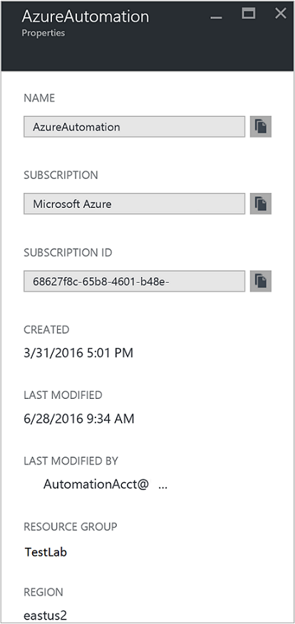
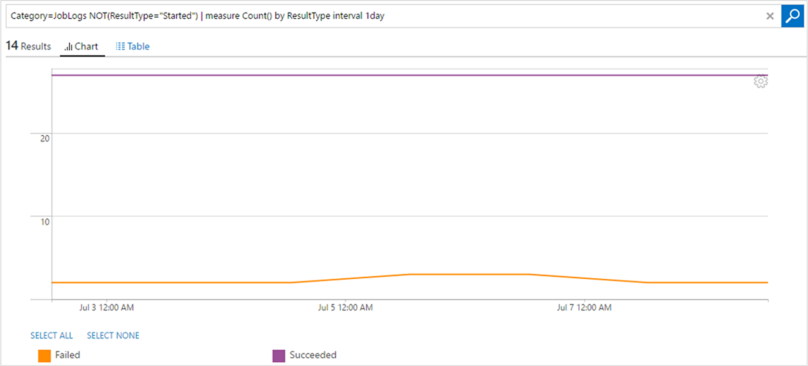

# Forward job status and job streams from Automation to Log Analytics (OMS)
Automation can send runbook job status and job streams to your Microsoft Operations Management Suite (OMS) Log Analytics workspace.  While you can view this information in the Azure portal or with PowerShell by individual job status or all jobs for a particular Automation account, anything advanced to support your operational requirements requires you to create custom PowerShell scripts.  Now with Log Anaytics you can:

* Get insight on your Automation jobs 
* Trigger an email or alert based on your runbook job status (e.g. failed or suspended) 
* Write advanced queries across your job streams 
* Correlate jobs across Automation accounts 
* Visualize your job history over time     

## Prerequisites and deployment considerations
To start sending your Automation logs to Log Analytics, you must have the following:

1. An OMS subscription. For additional information, see [Get started with Log Analytics](../log-analytics/log-analytics-get-started.md).  
   
   > [!NOTE]
   > The OMS workspace and Automation account need to be in the same Azure subscription in order for this configuration to work correctly. 
   > 
   > 
2. An [Azure Storage account](../storage/storage-create-storage-account.md).  
   
   > [!NOTE]
   > The Storage account *must* be in the same region as the Automation account. 
   > 
   > 
3. Azure PowerShell with version 1.0.8 or newer of the Operational Insights cmdlets. For information about this release and how to install it, see [How to install and configure Azure PowerShell](../powershell-install-configure.md).
4. Azure Diagnostic and Log Analytics PowerShell.  For further information about this release and how to install it, see [Azure Diagnostic and Log Analytics](https://www.powershellgallery.com/packages/AzureDiagnosticsAndLogAnalytics/0.1).  
5. Download the PowerShell script **Enable-AzureDiagnostics.ps1** from the [PowerShell Gallery](https://www.powershellgallery.com/packages/Enable-AzureDiagnostics/1.0/DisplayScript). This script will configure the following:
   * A storage account to hold the runbook job status and stream data for an Automation account that you specify.
   * Enable the collection of this data from your Automation account to store it in an Azure Blob storage account in JSON format.
   * Configure collecting the data from your Blob storage account to OMS Log Analytics.
   * Enable the Automation Log Analytics solution your OMS workspace.   

The **Enable-AzureDiagnostics.ps1** script requires the following parameters during execution:

* *AutomationAccountName* - the name of your Automation account
* *LogAnalyticsWorkspaceName* - the name of your OMS workspace

To find the values for *AutomationAccountName*, in the Azure portal select your Automation account from the **Automation account** blade and select **All settings**.  From the **All settings** blade, under **Account Settings** select **Properties**.  In the **Properties** blade, you can note these values.  .

## Setup integration with Log Analytics
1. On your computer, start **Windows PowerShell** from the **Start** screen.  
2. From the PowerShell command-line shell, navigate to the folder which contains the script you downloaded and execute it changing the values for parameters *-AutomationAccountName* and *-LogAnalyticsWorkspaceName*.
   
   > [!NOTE]
   > You will be prompted to authenticate with Azure after you execute the script.  You **must** log in with an account that is a member of the Subscription Admins role and co-administrator of the subscription.   
   > 
   > 
   
        .\Enable-AzureDiagnostics -AutomationAccountName <NameofAutomationAccount> `
        -LogAnalyticsWorkspaceName <NameofOMSWorkspace> `
3. After running this script you should see records in Log Analytics about 30 minutes after new diagnostic data is written to storage.  If records are not available after this time refer to the troubleshooting section in [JSON files in blob storage](../log-analytics/log-analytics-azure-storage-json.md#troubleshooting-configuration-for-azure-diagnostics-written-to-blob-in-json).

### Verify configuration
To confirm the script configured your Automation account and OMS wokspace successfully, you can perform the following steps in PowerShell.  Before you do that, to find the values for your OMS workspace name and resource group name, from the Azure portal, navigate to Log Analytics (OMS) and in the Log Analytics (OMS) blade, note the value for **Name** and **Resource Group**.    We will use these two values when we verify the configuration in your OMS workspace using the PowerShell cmdlet [Get-AzureRmOperationalInsightsStorageInsight](https://msdn.microsoft.com/library/mt603567.aspx).

1. From the Azure portal, navigate to Storage Accounts and search for the following storage account, which uses the naming convention - *AutomationAccountNameomsstorage*.  After a runbook job completes, shortly afterwards you should see two Blob containers created - **insights-logs-joblogs** and **insights-logs-jobstreams**.  
2. From PowerShell, run the following PowerShell code, changing the values for the parameters **ResourceGroupName** and **WorkspaceName** that you copied or noted earlier.  
   
   Login-AzureRmAccount
   Get-AzureRmSubscription -SubscriptionName 'SubscriptionName' | Set-AzureRmContext
   Get-AzureRmOperationalInsightsStorageInsight -ResourceGroupName "OMSResourceGroupName" `
   -Workspace "OMSWorkspaceName" 
   
   This will return the storage insight for the specified OMS workspace.  We want to confirm the storage insight for the  Automation account we specified earlier exists and the **State** object shows a value of **OK**.  .

## Viewing Automation Logs in Log Analytics
Now that you have started sending your Automation job logs to Log Analytics, let’s see what you can do with these logs inside OMS.   

### Send an email when a runbook job fails or suspends
One of our top customer asks is for the ability to send an email or a text when something goes wrong with a runbook job.   

To create an alert rule, you start by creating a log search for the runbook job records that should invoke the alert.  The **Alert** button will then be available so you can create and configure the alert rule.

1. From the OMS Overview page, click **Log Search**.
2. Create a log search query for your alert by typing in the following in the query field:  `Category=JobLogs (ResultType=Failed || ResultType=Suspended)`.  You can also group by the RunbookName by using: `Category=JobLogs (ResultType=Failed || ResultType=Suspended) | measure Count() by RunbookName_s`.   
   
   If you have set up logs from more than one Automation account or subscription to your workspace, you may also be interested in grouping your alerts by the subscription or Automation account.  Automation account name can be derived from the Resource field in the search of JobLogs.  
3. Click **Alert** at the top of the page to open the **Add Alert Rule** screen.  For further details on the options to configure the alert, please see [Alerts in Log Analytics](../log-analytics/log-analytics-alerts.md#creating-an-alert-rule).

### Find all jobs that have completed with errors
In addition to alerting based off of failures, you probably would like to know when a runbook job has had a non-terminating error (PowerShell produces an error stream, but non-terminating errors do not cause your job to suspend or fail).    

1. In the OMS portal, click **Log Search**.
2. In the query field, type `Category=JobStreams StreamType_s=Error | measure count() by JobId_g` and then click **Search**.

### View job streams for a job
When you are debugging a job, you may also want to look into the job streams.  The query below shows all the streams for a single job with GUID  2ebd22ea-e05e-4eb9-9d76-d73cbd4356e0:   

`Category=JobStreams JobId_g="2ebd22ea-e05e-4eb9-9d76-d73cbd4356e0" | sort TimeGenerated | select ResultDescription` 

### View historical job status
Finally, you may want to visualize your job history over time.  You can use this query to search for the status of your jobs over time. 

`Category=JobLogs NOT(ResultType="started") | measure Count() by ResultType interval 1day`  
   

## Summary
By sending your Automation job status and stream data to Log Analytics, you can get better insight into the status of your Automation jobs by setting up alerts to notify you when there is an issue, and custom dashboards using advanced queries to visualize your runbook results, runbook job status, and other related key indicators or metrics.  This will help provide greater operational visibility and address incidents quicker.  

## Next steps
* To learn more about how to construct different search queries and review the Automation job logs with Log Analytics, see [Log searches in Log Analytics](../log-analytics/log-analytics-log-searches.md)
* To understand how to create and retrieve output and error messages from runbooks, see [Runbook output and messages](automation-runbook-output-and-messages.md) 
* To learn more about runbook execution, how to monitor runbook jobs, and other technical details, see [Track a runbook job](automation-runbook-execution.md)
* To learn more about OMS Log Analytics and data collection sources, see [Collecting Azure storage data in Log Analytics overview](../log-analytics/log-analytics-azure-storage.md)

