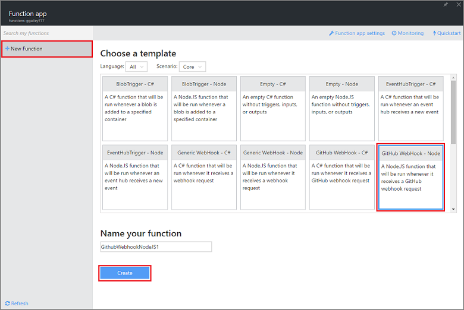
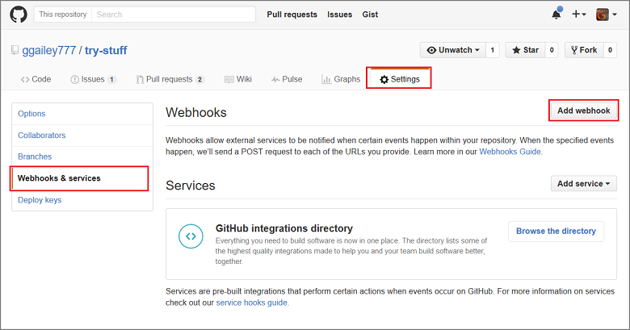

# Create a webhook or API Azure Function
Azure Functions is an event-driven, compute-on-demand experience that enables you to create scheduled or triggered units of code implemented in a variety of programming languages. To learn more about Azure Functions, see the [Azure Functions Overview](functions-overview.md).

This topic shows you how to create a new Node.js function that is invoked by a GitHub webhook. The new function is created based on a pre-defined template in the Azure Functions portal. You can also watch a short video to see how these steps are performed in the portal.

## Watch the video
The following video show how to perform the basic steps in this tutorial 

[!VIDEO https://channel9.msdn.com/Series/Windows-Azure-Web-Sites-Tutorials/Create-a-Web-Hook-or-API-Azure-Function/player]

## Create a webhook-triggered function from the template
A function app hosts the execution of your functions in Azure. Before you can create a function, you need to have an active Azure account. If you don't already have an Azure account, [free accounts are available](https://azure.microsoft.com/free/). 

1. Go to the [Azure Functions portal](https://functions.azure.com/signin) and sign-in with your Azure account.
2. If you have an existing function app to use, select it from **Your function apps** then click **Open**. To create a new function app, type a unique **Name** for your new function app or accept the generated one, select your preferred **Region**, then click **Create + get started**. 
3. In your function app, click **+ New Function** > **GitHub Webhook - Node** > **Create**. This creates a function with a default name that is based on the specified template. 
   
     
4. In the **Develop** tab, note the sample express.js function in the **Code** window. This function receives a GitHub request from an issue comment webhook, logs the issue text and sends a response to the webhook as `New GitHub comment: <Your issue comment text>`.

     

1. Copy the **Function URL** and **GitHub Secret** values. You will need these when you create the webhook in GitHub. 
2. Scroll down to **Run**, note the predefined JSON body of an issue comment in the Request body, then click **Run**. 
   
    You can always test a new template-based function right in the **Develop** tab by supplying any expected body JSON data and clicking the **Run** button. In this case, the template has a predefined body for an issue comment. 

Next, you will create the actual webhook in your GitHub repository.

## Configure the webhook
1. In GitHub, navigate to a repository that you own; this includes any repositories that you have forked.
2. Click **Settings** > **Webhooks & services** > **Add webhook**.
   
       
3. Paste your function's URL and secret into **Payload URL** and **Secret**, then click **Let me select individual events**, select **Issue comment** and click **Add webhook**.
   
     

At this point, the GitHub webhook is configured to trigger your function when a new issue comment is added.  
Now, it's time to test it out.

## Test the function
1. In your GitHub repo, open the **Issues** tab in a new browser window, click **New Issue**, type a title then click **Submit new issue**. You can also open an existing issue.
2. In the issue, type a comment and click **Comment**. At this point, you can go back to your new webhook in GitHub and under **Recent Deliveries** see that a webhook request was sent and that the body of response is `New GitHub comment: <Your issue comment text>`.
3. Back in the Functions portal, scroll down to the logs and see that the function has been triggered and the value `New GitHub comment: <Your issue comment text>` is written to the streaming logs.

## Next steps
See these topics for more information about Azure Functions.

* [Azure Functions developer reference](functions-reference.md)  
  Programmer reference for coding functions.
* [Testing Azure Functions](functions-test-a-function.md)  
  Describes various tools and techniques for testing your functions.
* [How to scale Azure Functions](functions-scale.md)  
  Discusses service plans available with Azure Functions, including the Dynamic service plan, and how to choose the right plan.  

[!INCLUDE [Getting Started Note](../../includes/functions-get-help.md)]

