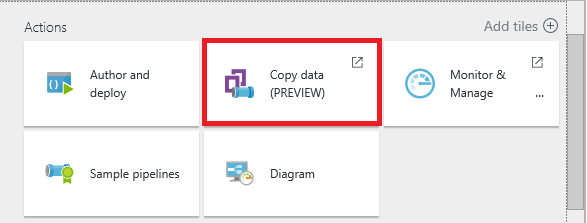
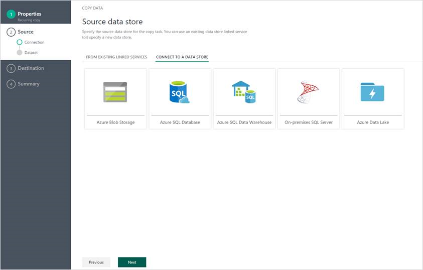
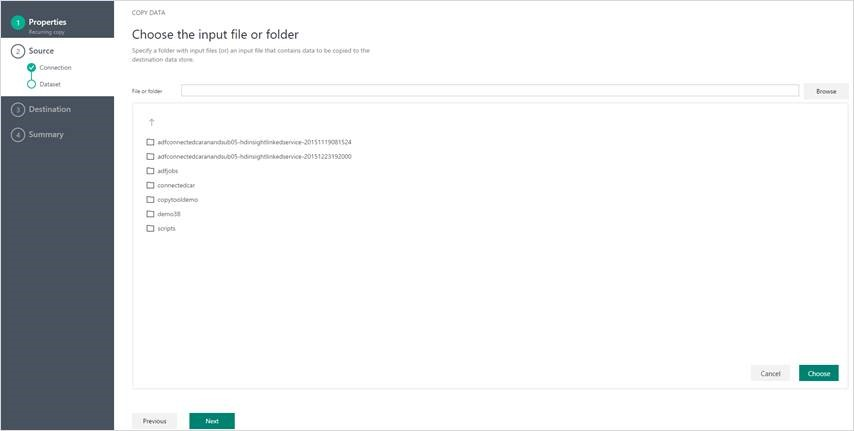
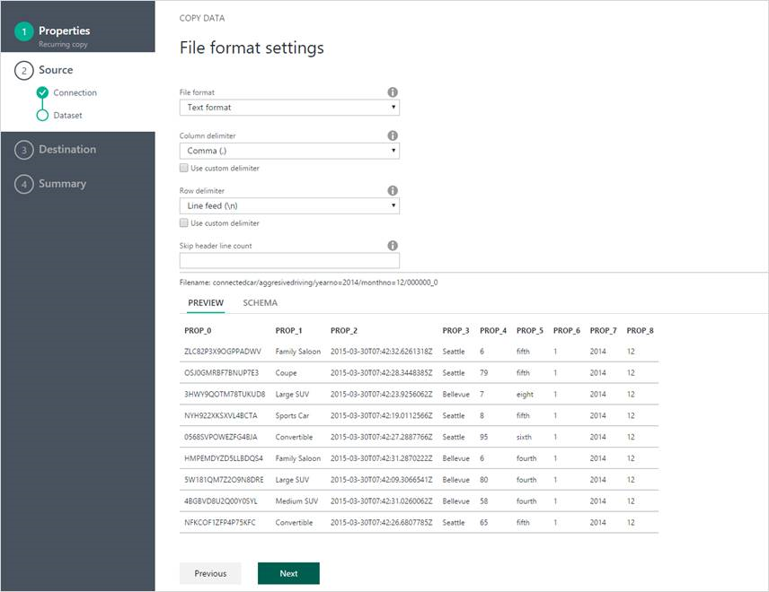
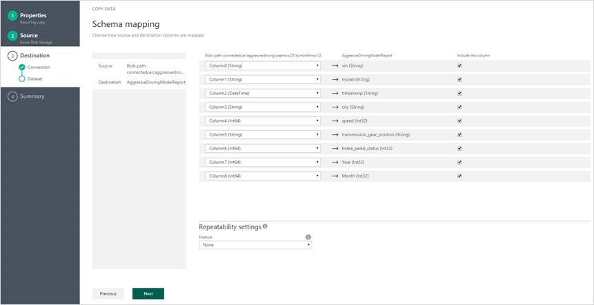
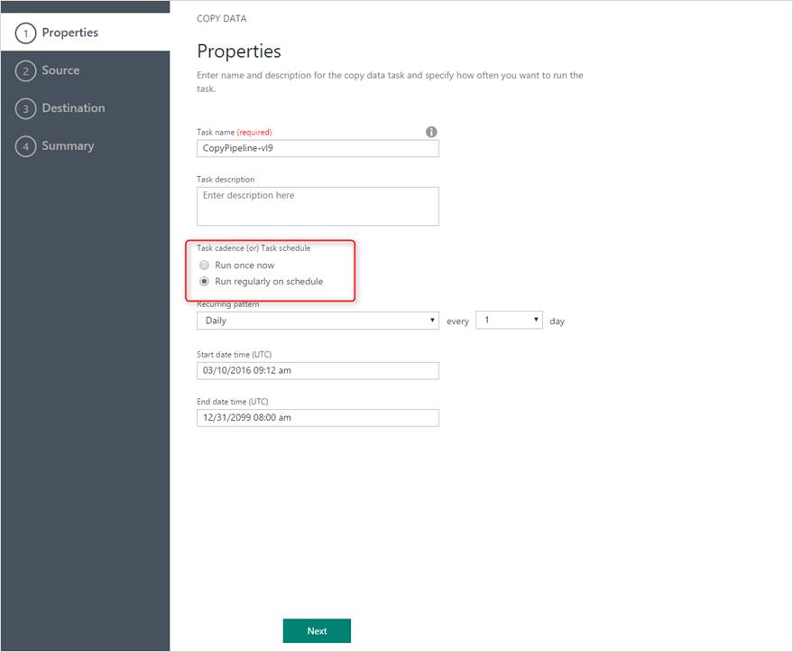

# Data Factory Copy Wizard
The Azure Data Factory Copy Wizard allows you to create a pipeline to copy data from supported sources to destinations without writing JSON definitions for linked services, datasets, and pipelines. To start the Copy Wizard, click the **Copy data** tile on the home page of your data factory.

## Features
### An intuitive and seamless wizard for copying data
This wizard allows you to easily move data from a source to a destination in minutes with the following easy steps:

1. Select the source.
2. Select the destination.
3. Configure the settings.

### Rich data exploration and schema mappings
You can browse tables and folders, preview data, map a schema, validate expressions, and perform simple data transformations within the wizard.

**Browse tables/folders**

### Scalable experience for diverse data and object types
The experience is designed with big data in mind from the start. It is simple and efficient to author Data Factory pipelines that move hundreds of folders, files, or tables.

**Preview data**

**Map a schema**

**Perform simple transformations**

### Scalable experience for diverse data and object types
By using the Copy Wizard, you can efficiently and simply move hundreds of folders, files, or tables.

### Richer scheduling options
You can run the copy operation once or on a schedule (hourly, daily, and so on). Both of these options can be used for the breadth of the connectors across on-premises, cloud, and local desktop copy.

A one-time copy operation enables data movement from a source to a destination only once. It applies to data of any size and any supported format. The scheduled copy allows you to copy data on a prescribed recurrence. You can use rich settings (like retry, timeout, and alerts) to configure the scheduled copy.

## Variables in the Azure blob folder path
You can use variables in the folder path to copy data from a folder that is determined at runtime based on [WindowStart system variables](data-factory-functions-variables.md#data-factory-system-variables). The supported variables are: **{year}**, **{month}**, **{day}**, **{hour}**, **{minute}**, and **{custom}**. Example: inputfolder/{year}/{month}/{day}.

Suppose that you have input folders in the following format:

    2016/03/01/01
    2016/03/01/02
    2016/03/01/03
    ...

Click the **Browse** button for **File or folder**, browse to one of these folders (for example, 2016->03->01->02), and click **Choose**. You should see **2016/03/01/02** in the text box. Now, replace **2016** with **{year}**, **03** with **{month}**, **01** with **{day}**, and **02** with **{hour}**, and press Tab. You should see drop-down lists to select the format for these four variables:

   

As shown in the following screenshot, you can also use a **custom** variable and any [supported format strings](https://msdn.microsoft.com/library/8kb3ddd4.aspx). To select a folder with that structure, use the **Browse** button first. Then replace a value with **{custom}**, and press Tab to see the text box where you can type the format string.     

## Next steps
For a quick walkthrough of using the Data Factory Copy Wizard to create a pipeline with Copy Activity, see [Tutorial: Create a pipeline using the Copy Wizard](data-factory-copy-data-wizard-tutorial.md).

