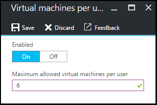
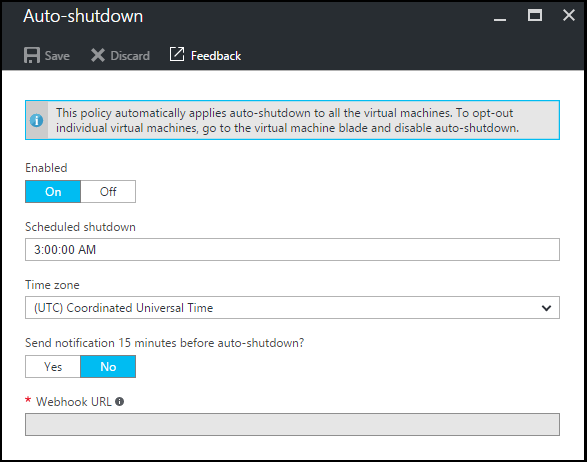

# Define lab policies in Azure DevTest Labs
> [!VIDEO https://channel9.msdn.com/Blogs/Windows-Azure/How-to-set-VM-policies-in-a-DevTest-Lab/player]
> 
> 

Azure DevTest Labs enables you to specify key policies that help you to control cost and minimize waste in your labs. These lab policies include the maximum number of VMs created per user and per lab, and various auto-shutdown and auto-start options. 

## Accessing a lab's policies in Azure DevTest Labs
The following steps guide you through setting up policies for a lab in Azure DevTest Labs:

To view (and change) the policies for a lab, follow these steps:

1. Sign in to the [Azure portal](http://go.microsoft.com/fwlink/p/?LinkID=525040).
2. Select **More services**, and then select **DevTest Labs** from the list.
3. From the list of labs, select the desired lab.   
4. Select **Policy settings**.
5. The **Policy settings** blade contains a menu of settings that you can specify: 
   
    
   
    To learn more about setting a policy, select it from the following list:
   
   * [Allowed virtual machine sizes](#set-allowed-virtual-machine-sizes) - Select the list of VM sizes allowed in the lab. A user can create VMs only from this list.
   * [Virtual machines per user](#set-virtual-machines-per-user) - Specify the maximum number of VMs that can be created by a user. 
   * [Virtual machines per lab](#set-virtual-machines-per-lab) - Specify the maximum number of VMs that can be created for a lab. 
   * [Auto-shutdown](#set-auto-shutdown) - Specify the time when the current lab's VMs automatically shut down.
   * [Auto-start](#set-auto-start) - Specify the time when the current lab's VMs automatically start up.

## Set allowed virtual machine sizes
The policy for setting the allowed VM sizes helps to minimize lab waste by enabling you to specify which VM sizes are allowed in the lab. If this policy is activated, only VM sizes from this list can be used to create VMs.

1. On the lab's **Policy settings** blade, select **Allowed virtual machines sizes**.
   
    
2. Select **On** to enable this policy, and **Off** to disable it.
3. If you enable this policy, select one or more VM sizes that can be created in your lab.
4. Select **Save**.

## Set virtual machines per user
The policy for **Virtual machines per user** allows you to specify the maximum number of VMs that can be created by an individual user. 
If a user attempts to create a VM when the user limit has been met, an error message indicates that the VM cannot be created. 

1. On the lab's **Policy settings** blade, select **Virtual machines per user**.
   
    
2. Select **On** to enable this policy, and **Off** to disable it.
3. If you enable this policy, enter a numeric value indicating the maximum number of VMs that can be created by a user. 
   If you enter a number that is not valid, the UI displays the maximum number allowed for this field.
4. Select **Save**.

## Set virtual machines per lab
The policy for **Virtual machines per lab** allows you to specify the maximum number of VMs that can be created for the current lab. 
If a user attempts to create a VM when the lab limit has been met, an error message indicates that the VM cannot be created. 

1. On the lab's **Policy settings** blade, select **Virtual machines per lab**.
   
    
2. Select **On** to enable this policy, and **Off** to disable it.
3. If you enable this policy, enter a numeric value indicating the maximum number of VMs that can be created for the current lab. 
   If you enter a number that is not valid, the UI displays the maximum number allowed for this field.
4. Select **Save**.

## Set auto-shutdown
The auto-shutdown policy helps to minimize lab waste by allowing you to specify the time that this lab's VMs shut down.

1. On the lab's **Policy settings** blade, select **Auto-shutdown**.
   
    
2. Select **On** to enable this policy, and **Off** to disable it.
3. If you enable this policy, specify the local time to shut down all VMs in the current lab.
4. Select **Save**.
5. By default, once enabled, this policy applies to all VMs in the current lab. To remove this setting from a specific VM, open the VM's blade and change its **Auto-shutdown** setting 

## Set auto-start
The auto-start policy allows you to specify when the VMs in the current lab should be started.  

1. On the lab's **Policy settings** blade, select **Auto-start**.
   
    
2. Select **On** to enable this policy, and **Off** to disable it.
3. If you enable this policy, specify the local scheduled start time and the days of the week for which the time applies. 
4. Select **Save**.
5. Once enabled, this policy is not automatically applied to any VMs in the current lab. To apply this setting to a specific VM, open the VM's blade and change its **Auto-start** setting 

[!INCLUDE [devtest-lab-try-it-out](../../includes/devtest-lab-try-it-out.md)]

## Next steps
Once you've defined and applied the various VM policy settings for your lab, here are some things to try next:

* [Configure cost management](devtest-lab-configure-cost-management.md) - Illustrates how to use the **Monthly Estimated Cost Trend** chart  
  to view the current month's estimated cost-to-date and the projected end-of-month cost.
* [Create custom image](devtest-lab-create-template.md) - When you create a VM, you specify a base, which can be either a custom image or a Marketplace image. This article illustrates
  how to create a custom image from a VHD file.
* [Configure Marketplace images](devtest-lab-configure-marketplace-images.md) - Azure DevTest Labs supports creating VMs based on Azure Marketplace images. This article
  illustrates how to specify which, if any, Azure Marketplace images can be used when creating VMs in a lab.
* [Create a VM in a lab](devtest-lab-add-vm-with-artifacts.md) - Illustrates how to create a VM from a base image (either custom or Marketplace), and how to work with
  artifacts in your VM.

