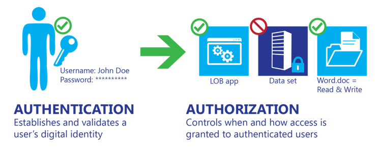
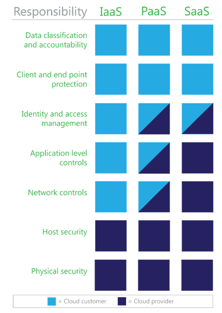
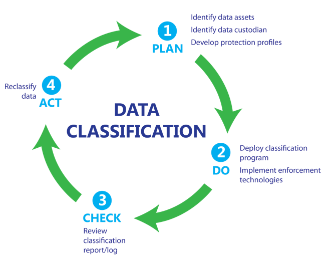
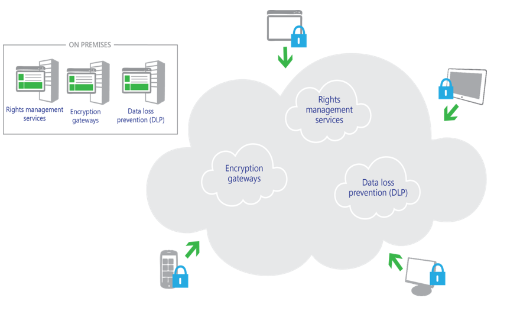

# Data classification for Azure
This article provides an introduction to the fundamentals of data classification and highlights its value, specifically in the context of cloud computing and using Microsoft Azure. 

## Data classification fundamentals
Successful data classification in an organization requires broad awareness of your organization’s needs and a thorough understanding of where your data assets reside.  

Data exists in one of three basic states: 

* At rest 
* In process 
* In transit 

All three states require unique technical solutions for data classification, but the applied principles of data classification should be the same for each. Data that is classified as confidential needs to stay confidential when at rest, in process, and in transit. 

Data can also be either structured or unstructured. Typical classification processes for the structured data found in databases and spreadsheets are less complex and time-consuming to manage than those for unstructured data such as documents, source code, and email. 

> [!TIP]
> for more information regarding Azure capabilities and best practices for data encryption read [Azure Data Encryption Best Practices](azure-security-data-encryption-best-practices.md)
> 
> 

In general, organizations will have more unstructured data than structured data. Regardless of whether data is structured or unstructured, it is important for you to manage data sensitivity. When properly implemented, data classification helps ensure that sensitive or confidential data assets are managed with greater oversight than data assets that are considered public or free to distribute. 

### Controlling access to data
Authentication and authorization are often confused with each other and their roles misunderstood. In reality they are quite different, as shown in the following figure.  

### Authentication
Authentication typically consists of at least two parts: a username or user ID to identify a user and a token, such as a password, to confirm that the username credential is valid. The process does not provide the authenticated user with access to any items or services; it verifies that the user is who they say they are.   

> [!TIP]
> [Azure Active Directory](../active-directory/active-directory-whatis.md) provides cloud-based identity services that allow you to authenticate and authorize users. 
> 
> 

### Authorization
Authorization is the process of providing an authenticated user the ability to access an application, data set, data file, or some other object. Assigning authenticated users the rights to use, modify, or delete items that they can access requires attention to data classification. 

Successful authorization requires implementation of a mechanism to validate individual users’ needs to access files and information based on a combination of role, security policy, and risk policy considerations. 
For example, data from specific line-of-business (LOB) applications might not need to be accessed by all employees, and only a small subset of employees will likely need access to human resources (HR) files. But for organizations to control who can access data, as well as when and how, an effective system for authenticating users must be in place. 

> [!TIP]
> in Microsoft Azure, make sure to leverage Azure Role-Based Access Control (RBAC) to grant only the amount of access that users need to perform their jobs. Read [Use role assignments to manage access to your Azure Active Directory resources](../active-directory/role-based-access-control-configure.md) for more information. 
> 
> 

### Roles and responsibilities in cloud computing
Although cloud providers can help manage risks, customers need to ensure that data classification management and enforcement is properly implemented to provide the appropriate level of data management services.  

Data classification responsibilities will vary based on which cloud service model is in place, as shown in the following figure. The three primary cloud service models are infrastructure as a service (IaaS), platform as a service (PaaS), and software as a service (SaaS). Implementation of data classification mechanisms will also vary based on the reliance on and expectations of the cloud provider. 

Although you are responsible for classifying your data, cloud providers should make written commitments about how they will secure and maintain the privacy of the customer data stored within their cloud.  

* **IaaS providers** requirements are limited to ensuring that the virtual environment can accommodate data classification capabilities and customer compliance requirements. IaaS providers have a smaller role in data classification because they only need to ensure that customer data addresses compliance requirements. However, providers must still ensure that their virtual environments address data classification requirements in addition to securing their data centers.
* **PaaS providers** responsibilities may be mixed, because the platform could be used in a layered approach to provide security for a classification tool. PaaS providers may be responsible for authentication and possibly some authorization rules, and must provide security and data classification capabilities to their application layer. Much like IaaS providers, PaaS providers need to ensure that their platform complies with any relevant data classification requirements.
* **SaaS providers** will frequently be considered as part of an authorization chain, and will need to ensure that the data stored in the SaaS application can be controlled by classification type. SaaS applications can be used for LOB applications, and by their very nature need to provide the means to authenticate and authorize data that is used and stored. 

## Classification process
Many organizations that understand the need for data classification and want to implement it face a basic challenge: where to begin?

One effective and simple way to implement data classification is to use the PLAN, DO, CHECK, ACT model from [MOF](https://technet.microsoft.com/solutionaccelerators/dd320379.aspx). The following figure charts the tasks that are required to successfully implement data classification in this model.  

1. **PLAN**. Identify data assets, a data custodian to deploy the classification program, and develop protection profiles. 
2. **DO**. After data classification policies are agreed upon, deploy the program and implement enforcement technologies as needed for confidential data.  
3. **CHECK**. Check and validate reports to ensure that the tools and methods being used are effectively addressing the classification policies. 
4. **ACT**. Review the status of data access and review files and data that require revision using a reclassification and revision methodology to adopt changes and to address new risks.  

### Select a terminology model that addresses your needs
Several types of processes exist for classifying data, including manual processes, location-based processes that classify data based on a user’s or system’s location, application-based processes such as database-specific classification, and automated processes used by various technologies, some of which are described in the “Protecting confidential data” section later in this article.  

This article introduces two generalized terminology models that are based on well-used and industry-respected models. These terminology models, both of which provide three levels of classification sensitivity, are shown in the following table.  

> [!NOTE]
> when classifying a file or resource that combines data that would typically be classified at differing levels, the highest level of classification present should establish the overall classification. For example, a file containing sensitive and restricted data should be classified as restricted.  
> 
> 

| **Sensitivity** | **Terminology model 1** | **Terminology model 2** |
| --- | --- | --- |
| High |Confidential |Restricted |
| Medium |For internal use only |Sensitive |
| Low |Public |Unrestricted |

#### Confidential (restricted)
Information that is classified as confidential or restricted includes data that can be catastrophic to one or more individuals and/or organizations if compromised or lost. Such information is frequently provided on a “need to know” basis and might include: 

* Personal data, including personally identifiable information such as Social Security or national identification numbers, passport numbers, credit card numbers, driver's license numbers, medical records, and health insurance policy ID numbers.  
* Financial records, including financial account numbers such as checking or investment account numbers. 
* Business material, such as documents or data that is unique or specific intellectual property.  
* Legal data, including potential attorney-privileged material. 
* Authentication data, including private cryptography keys, username password pairs, or other identification sequences such as private biometric key files. 

Data that is classified as confidential frequently has regulatory and compliance requirements for data handling. 

#### For internal use only (sensitive)
Information that is classified as being of medium sensitivity includes files and data that would not have a severe impact on an individual and/or organization if lost or destroyed. Such information might include: 

* Email, most of which can be deleted or distributed without causing a crisis (excluding mailboxes or email from individuals who are identified in the confidential classification).  
* Documents and files that do not include confidential data.

Generally, this classification includes anything that is not confidential. This classification can include most business data, because most files that are managed or used day-to-day can be classified as sensitive. With the exception of data that is made public or is confidential, all data within a business organization can be classified as sensitive by default. 

#### Public (unrestricted)
Information that is classified as public includes data and files that are not critical to business needs or operations. This classification can also include data that has deliberately been released to the public for their use, such as marketing material or press announcements. In addition, this classification can include data such as spam email messages stored by an email service. 

### Define data ownership
It’s important to establish a clear custodial chain of ownership for all data assets. The following table identifies different data ownership roles in data classification efforts and their respective rights.  

| **Role** | **Create** | **Modify/delete** | **Delegate** | **Read** | **Archive/restore** |
| --- | --- | --- | --- | --- | --- |
| Owner |X |X |X |X |X |
| Custodian | | |X | | |
| Administrator | | | | |X |
| User\* | |X | |X | |

**Users may be granted additional rights such as edit and delete by a custodian* 

> [!NOTE]
> this table does not provide an exhaustive list of roles and rights, but merely a representative sample. 
> 
> 

The **data asset owner** is the original creator of the data, who can delegate ownership and assign a custodian. When a file is created, the owner should be able to assign a classification, which means that they have a responsibility to understand what needs to be classified as confidential based on their organization’s policies. All of a data asset owner’s data can be auto-classified as for internal use only (sensitive) unless they are responsible for owning or creating confidential (restricted) data types. Frequently, the owner’s role will change after the data is classified. For example, the owner might create a database of classified information and relinquish their rights to the data custodian.  

> [!NOTE]
> data asset owners often use a mixture of services, devices, and media, some of which are personal and some of which belong to the organization. A clear organizational policy can help ensure that usage of devices such as laptops and smart devices is in accordance with data classification guidelines.  
> 
> 

The **data asset custodian** is assigned by the asset owner (or their delegate) to manage the asset according to agreements with the asset owner or in accordance with applicable policy requirements. Ideally, the custodian role can be implemented in an automated system. An asset custodian ensures that necessary access controls are provided and is responsible for managing and protecting assets delegated to their care. The responsibilities of the asset custodian could include:  

* Protecting the asset in accordance with the asset owner’s direction or in agreement with the asset owner 
* Ensuring that classification policies are complied with 
* Informing asset owners of any changes to agreed-upon controls and/or protection procedures prior to those changes taking effect 
* Reporting to the asset owner about changes to or removal of the asset custodian’s responsibilities 
* An **administrator** represents a user who is responsible for ensuring that integrity is maintained, but they are not a data asset owner, custodian, or user. In fact, many administrator roles provide data container management services without having access to the data. The administrator role includes backup and restoration of the data, maintaining records of the assets, and choosing, acquiring, and operating the devices and storage that house the assets. 
* The asset user includes anyone who is granted access to data or a file. Access assignment is often delegated by the owner to the asset custodian.  

### Implementation
Management considerations apply to all classification methodologies. These considerations need to include details about who, what, where, when, and why a data asset would be used, accessed, changed, or deleted. All asset management must be done with an understanding of how an organization views its risks, but a simple methodology can be applied as defined in the data classification process. Additional considerations for data classification include the introduction of new applications and tools, and managing change after a classification method is implemented.  

### Reclassification
Reclassifying or changing the classification state of a data asset needs to be done when a user or system determines that the data asset’s importance or risk profile has changed. This effort is important for ensuring that the classification status continues to be current and valid. Most content that is not classified manually can be classified automatically or based on usage by a data custodian or data owner. 

### Manual data reclassification
Ideally, this effort would ensure that the details of a change are captured and audited. The most likely reason for manual reclassification would be for reasons of sensitivity, or for records kept in paper format, or a requirement to review data that was originally misclassified. Because this paper considers data classification and moving data to the cloud, manual reclassification efforts would require attention on a case-by-case basis and a risk management review would be ideal to address classification requirements. Generally, such an effort would consider the organization’s policy about what needs to be classified, the default classification state (all data and files being sensitive but not confidential), and take exceptions for high-risk data. 

### Automatic data reclassification
Automatic data reclassification uses the same general rule as manual classification. The exception is that automated solutions can ensure that rules are followed and applied as needed. Data classification can be done as part of a data classification enforcement policy, which can be enforced when data is stored, in use, and in transit using authorization technology.

* Application-based. Using certain applications by default sets a classification level. For example, data from customer relationship management (CRM) software, HR, and health record management tools is confidential by default. 
* Location-based. Data location can help identify data sensitivity. For example, data that is stored by an HR or financial department is more likely to be confidential in nature.  

### Data retention, recovery, and disposal
Data recovery and disposal, like data reclassification, is an essential aspect of managing data assets. The principles for data recovery and disposal would be defined by a data retention policy and enforced in the same manner as data reclassification; such an effort would be performed by the custodian and administrator roles as a collaborative task.  

Failure to have a data retention policy could mean data loss or failure to comply with regulatory and legal discovery requirements. Most organizations that do not have a clearly defined data retention policy tend to use a default “keep everything” retention policy. However, such a retention policy has additional risks in cloud services scenarios. 

For example, a data retention policy for cloud service providers can be considered as for "the duration of the subscription” (as long as the service is paid for, the data is retained). Such a pay-for-retention agreement may not address corporate or regulatory retention policies. Defining a policy for confidential data can ensure that data is stored and removed based on best practices. In addition, an archival policy can be created to formalize an understanding about what data should be disposed of and when. 

Data retention policy should address the required regulatory and compliance requirements, as well as corporate legal retention requirements. Classified data might provoke questions about retention duration and exceptions for data that has been stored with a provider; such questions are more likely for data that has not been classified correctly. 

> [!TIP]
> learn more about Azure Data Retention policies and more by reading the [Microsoft Online Subscription Agreement](https://azure.microsoft.com/support/legal/subscription-agreement/)
> 
> 

## Protecting confidential data
After data is classified, finding and implementing ways to protect confidential data becomes an integral part of any data protection deployment strategy. Protecting confidential data requires additional attention to how data is stored and transmitted in conventional architectures as well as in the cloud. 

This section provides basic information about some technologies that can automate enforcement efforts to help protect data that has been classified as confidential. 

As the following figure shows, these technologies can be deployed as on-premises or cloud-based solutions—or in a hybrid fashion, with some of them deployed on-premises and some in the cloud. (Some technologies, such as encryption and rights management, also extend to user devices.)  

### Rights management software
One solution for preventing data loss is rights management software. Unlike approaches that attempt to interrupt the flow of information at exit points in an organization, rights management software works at deep levels within data storage technologies. Documents are encrypted, and control over who can decrypt them uses access controls that are defined in an authentication control solution such as a directory service.  

> [!TIP]
> you can use Azure Rights Management (Azure RMS) as the information protection solution to protect data in different scenarios. Read [What is Azure Rights Management?](https://docs.microsoft.com/rights-management/understand-explore/what-is-azure-rms) for more information about this Azure solution.
> 
> 

Some of the benefits of rights management software include: 

* Safeguarded sensitive information. Users can protect their data directly using rights management-enabled applications. No additional steps are required—authoring documents, sending email, and publishing data offer a consistent data protection experience. 
* Protection travels with the data. Customers remain in control of who has access to their data, whether in the cloud, existing IT infrastructure, or at the user’s desktop. Organizations can choose to encrypt their data and restrict access according to their business requirements. 
* Default information protection policies. Administrators and users can use standard policies for many common business scenarios, such as "Company Confidential–Read Only" and "Do Not Forward." A rich set of usage rights are supported such as read, copy, print, save, edit, and forward to allow flexibility in defining custom usage rights. 

> [!TIP]
> you can protect data in Azure Storage by using [Azure Storage Service Encryption](../storage/storage-service-encryption.md) for Data at Rest. You can also use [Azure Disk Encryption](azure-security-disk-encryption.md) to help protect data contained on virtual disks used for Azure Virtual Machines.
> 
> 

### Encryption gateways
Encryption gateways operate in their own layers to provide encryption services by rerouting all access to cloud-based data. This approach should not be confused with that of a virtual private network (VPN). Encryption gateways are designed to provide a transparent layer to cloud-based solutions.   

Encryption gateways can provide a means to manage and secure data that has been classified as confidential by encrypting the data in transit as well as data at rest.  

Encryption gateways are placed into the data flow between user devices and application data centers to provide encryption/decryption services. These solutions, like VPNs, are predominantly on-premises solutions. They are designed to provide a third party with control over encryption keys, which helps reduce the risk of placing both the data and key management with one provider. Such solutions are designed, much like encryption, to work seamlessly and transparently between users and the service. 

> [!TIP]
> you can use Azure ExpressRoute to extend your on-premises networks into the Microsoft cloud over a dedicated private connection. Read [ExpressRoute technical overview](../expressroute/expressroute-introduction.md) for more information about this capability. Another options for cross premises connectivity between your on-premises network and [Azure is a site-to-site VPN](../vpn-gateway/vpn-gateway-howto-site-to-site-resource-manager-portal.md).
> 
> 

### Data loss prevention
Data loss (sometimes referred to as data leakage) is an important consideration, and the prevention of external data loss via malicious and accidental insiders is paramount for many organizations.  

Data loss prevention (DLP) technologies can help ensure that solutions such as email services do not transmit data that has been classified as confidential. Organizations can take advantage of DLP features in existing products to help prevent data loss. Such features use policies that can be easily created from scratch or by using a template supplied by the software provider.  

DLP technologies can perform deep content analysis through keyword matches, dictionary matches, regular expression evaluation, and other content examination to detect content that violates organizational DLP policies. For example, DLP can help prevent the loss of the following types of data: 

* Social Security and national identification numbers 
* Banking information 
* Credit card numbers  
* IP addresses 

Some DLP technologies also provide the ability to override the DLP configuration (for example, if an organization needs to transmit Social Security number information to a payroll processor). In addition, it’s possible to configure DLP so that users are notified before they even attempt to send sensitive information that should not be transmitted. 

> [!TIP]
> you can use Office 365 DLP capabilities to protect your documents. Read [Office 365 compliance controls: Data Loss Prevention](https://blogs.office.com/2013/10/28/office-365-compliance-controls-data-loss-prevention/) for more information.
> 
> 

## See also
* [Azure Data Encryption Best Practices](azure-security-data-encryption-best-practices.md)
* [Azure Identity Management and access control security best practices](azure-security-identity-management-best-practices.md)
* [Azure Security Team Blog](http://blogs.msdn.com/b/azuresecurity/)
* [Microsoft Security Response Center](https://technet.microsoft.com/library/dn440717.aspx)

