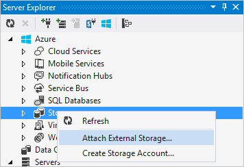
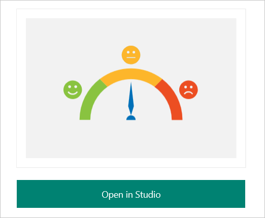
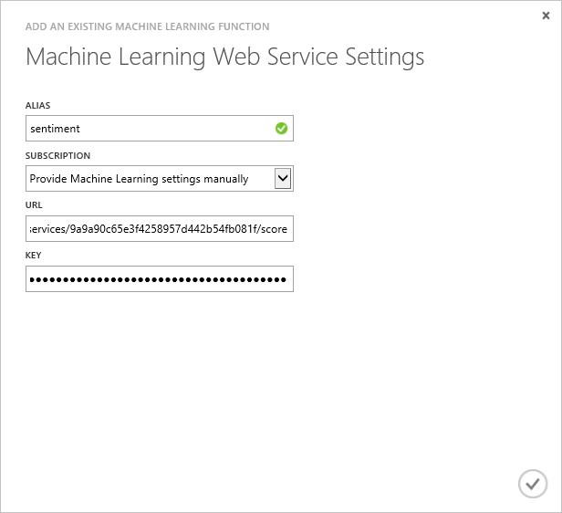
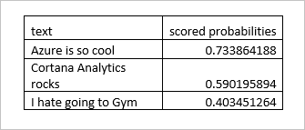
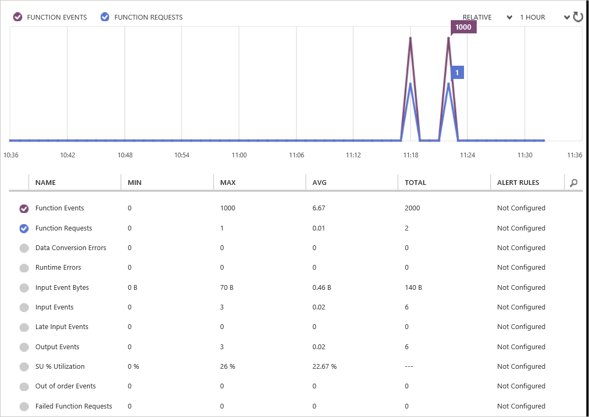

# Sentiment analysis by using Azure Stream Analytics and Azure Machine Learning
This article is designed to help you quickly set up a simple Azure Stream Analytics job, with Azure Machine Learning integration. We will use a sentiment analytics Machine Learning model from the Cortana Intelligence Gallery to analyze streaming text data, and determine the sentiment score in real time. The information in this article can help you understand scenarios such as real-time sentiment analytics on streaming Twitter data, analyze records of customer chats with support staff, and evaluate comments on forums, blogs, and videos, in addition to many other real-time, predictive scoring scenarios.

This article offers a sample CSV file with text as input in Azure Blob storage, shown in the following image. The job applies the sentiment analytics model as a user-defined function (UDF) on the sample text data from the blob store. The end result is placed in the same blob store in another CSV file. 

  

The following image demonstrates this configuration. For a more realistic scenario, you can replace Blob storage with streaming Twitter data from an Azure Event Hubs input. Additionally, you could build a [Microsoft Power BI](https://powerbi.microsoft.com/) real-time visualization of the aggregate sentiment.    

  

## Prerequisites
The prerequisites for completing the tasks that are demonstrated in this article are as follows:

* An active Azure subscription.
* A CSV file with some data in it. You can download the file shown in Figure 1 from [GitHub](https://github.com/jeffstokes72/azure-stream-analytics-repository/blob/master/sampleinputs.csv), or you can create your own file. For this article, we assume that you use the one provided for download on GitHub.

At a high level, to complete the tasks demonstrated in this article, you'll do the following:

1. Upload the CSV input file to Azure Blob storage.
2. Add a sentiment analytics model from the Cortana Intelligence Gallery to your Azure Machine Learning workspace.
3. Deploy this model as a web service in the Machine Learning workspace.
4. Create a Stream Analytics job that calls this web service as a function, to determine sentiment for the text input.
5. Start the Stream Analytics job and observe the output.

## Upload the CSV input file to Blob storage
For this step, you can use any CSV file, such as the one already specified as available for download on GitHub. You can use [Azure Storage Explorer](http://storageexplorer.com/) or Visual Studio to upload the file, or you can use custom code. We use examples based on Visual Studio.

1. In Visual Studio, click **Azure** > **Storage** > **Attach External Storage**. Enter an **Account Name** and **Account Key**.  
   
     
2. Expand the storage you attached in step 1, click **Create Blob Container**, and then enter a logical name. After you create the container, open it to view its contents. (It will be empty at this point).  
   
     
3. To upload the CSV file, click **Upload Blob**, and then click **file from the local disk**.  

## Add the sentiment analytics model from the Cortana Intelligence Gallery
1. Download the [predictive sentiment analytics model](https://gallery.cortanaintelligence.com/Experiment/Predictive-Mini-Twitter-sentiment-analysis-Experiment-1) from the Cortana Intelligence Gallery.  
2. In Machine Learning Studio, click **Open in Studio**.  
   
     
3. Sign in to go to the workspace. Select the location that best suits your own location.
4. Click **Run** at the bottom of the page.  
5. After the process runs successfully, click **Deploy Web Service**.
6. The sentiment analytics model is ready to use. To validate, click the **Test** button and provide text input, such as, “I love Microsoft.” The test should return a result similar to the following:

`'Predictive Mini Twitter sentiment analysis Experiment' test returned ["4","0.715057671070099"]...`  

  

In the **Apps** column, click the link for **Excel 2010 or earlier workbook** to get your API key and the URL that you’ll need later to set up the Stream Analytics job. (This step is required only to use a Machine Learning model from another Azure account workspace. This article assumes this is the case, to address that scenario.)  

Note the web service URL and access key from the downloaded Excel file, as shown below:  

  

## Create a Stream Analytics job that uses the Machine Learning model
1. Go to the [Azure portal](https://manage.windowsazure.com).  
2. Click **New** > **Data Services** > **Stream Analytics** > **Quick Create**. Enter a name for your job in **Job Name**, enter the appropriate region for the job in **Region**, and then select the account in **Regional Monitoring Storage Account**.    
3. After the job is created, on the **Inputs** tab, click **Add an Input**.  
   
     
4. On the first page of the **Add Input** wizard, click **Data stream**, and then click **Next**. On the next page, click **Blob Storage** as the input, and then click **Next**.  
5. On the **Blob Storage Settings** page of the wizard, provide the storage account blob container name you defined earlier when you uploaded the data. Click **Next**. For **Event Serialization Format**, click **CSV**. Accept the default values for the rest of the **Serialization settings** page. Click **OK**.  
6. On the **Outputs** tab, click **Add an Output**.  
   
     
7. Click **Blob Storage**, and then enter the same parameters, except for the container. The value for **Input** was configured to read from the container named “test” where the **CSV** file was uploaded. For **Output**, enter “testoutput”. Container names must be different. Verify that this container exists.     
8. Click **Next** to configure the output’s **Serialization settings**. As with **Input**, click **CSV**, and then click the **OK** button.
9. On the **Functions** tab, click **Add a Machine Learning Function**.  
   
     
10. On the **Machine Learning Web Service Settings** page, locate the Machine Learning workspace, web service, and default endpoint. For this article, apply the settings manually to gain familiarity with configuring a web service for any workspace, as long as you know the URL and have the API key. Enter the endpoint **URL** and **API key**. Click **OK**.    
    
        
11. On the **Query** tab, modify the query as follows:    
    
    ```
    WITH subquery AS (  
      SELECT text, sentiment(text) as result from input  
    )  
    
    Select text, result.[Scored Labels]  
    Into output  
    From subquery  
    ```    
12. Click **Save** to save the query.

## Start the Stream Analytics job and observe the output
1. Click **Start** at the bottom of the job page.
2. On the **Start Query Dialog**, click **Custom Time**, and then select a time prior to when you uploaded the CSV to Blob storage. Click **OK**.  
   
     
3. Go to the Blob storage by using the tool you used to upload the CSV file, for example, Visual Studio.
4. A few minutes after the job is started, the output container is created and a CSV file is uploaded to it.  
5. Open the file in the default CSV editor. Something similar to the following should be displayed:  
   
     

## Conclusion
This article demonstrates how to create a Stream Analytics job that reads streaming text data and applies sentiment analytics to the data in real time. You can accomplish all of this without needing to worry about the intricacies of building a sentiment analytics model. This is one of the advantages of the Cortana Intelligence Suite.

You also can view Azure Machine Learning function-related metrics. To do this, click the **Monitor** tab. Three function-related metrics are displayed.  

* **Function Requests** indicates the number of requests sent to a Machine Learning web service.  
* **Function Events** indicates the number of events in the request. By default, each request to a Machine Learning web service contains up to 1,000 events.  
* **Failed Function Requests** indicates the number of failed requests to the Machine Learning web service.  
  
      

