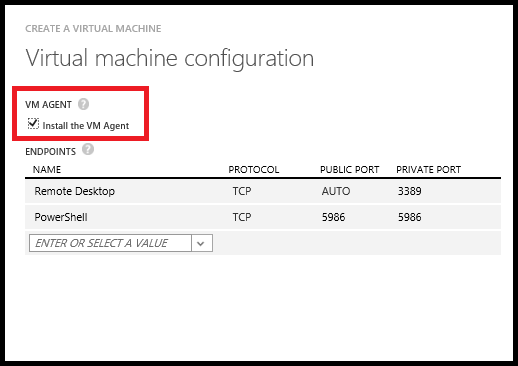

VM extensions can help you:

* Modify security and identity features, such as resetting account values and using antimalware
* Start, stop, or configure monitoring and diagnostics
* Reset or install connectivity features, such as RDP and SSH
* Diagnose, monitor, and manage your VMs

There are many other features as well; new VM Extension features are released regularly. This article describes the Azure VM Agents for Windows and Linux, and how they support VM Extension functionality. For a listing of VM Extensions by feature category, see [Azure VM Extensions and Features](../articles/virtual-machines/virtual-machines-windows-extensions-features.md).

## Azure VM Agents for Windows and Linux
The Azure Virtual Machines Agent (VM Agent) is a secured, light-weight process that installs, configures, and removes VM extensions on instances of Azure Virtual Machines from the Image Gallery and on custom VM instances if they have the VM Agent installed. The VM Agent acts as the secure local control service for your Azure VM. The extensions that the agent loads provide specific features to increase your productivity using the instance.

There are two Azure VM Agents, one for Windows VMs and one for Linux VMs. By default, the VM Agent is automatically installed when you create a VM from the Image Gallery, but you can also install the VM Agent after the instance is created or install it in a custom VM image that you then upload yourself.

> [!IMPORTANT]
> These VM Agents are very light-weight, services that enable secured administration of virtual machine instances. There might be cases in which you do not want the VM Agent. If so, be sure to create VMs that do not have the VM Agent installed. Although the VM Agent can be removed physically, the behavior of any VM Extensions on the instance is undefined. As a result, removing the VM Agent once it is installed is not supported at this time.
> 
> 

The VM Agent is enabled in the following situations:

* When you create an instance of a VM by using the **Quick Create** method in the Azure classic portal, or by using the **Custom Create** method in the Azure classic portal and making sure that the **Install the VM Agent** checkbox is selected (as shown in the image below). For more information, see [How to Create a Custom Virtual Machine](../articles/virtual-machines/virtual-machines-windows-classic-createportal.md).
  
  
* When you create an instance of a VM by using the [New-AzureVM](https://msdn.microsoft.com/library/azure/dn495254.aspx) or the [New-AzureQuickVM](https://msdn.microsoft.com/library/azure/dn495183.aspx) cmdlet. You can create a VM without the VM Agent installed by adding the **–DisableGuestAgent** parameter to the [Add-AzureProvisioningConfig](https://msdn.microsoft.com/library/azure/dn495299.aspx) cmdlet.
* By manually downloading and installing the VM Agent (either the Windows or Linux version) on an existing VM instance and then setting the **ProvisionGuestAgent** value to **true** using PowerShell or a REST call. (If you do not set this value after manually installing the VM Agent, the addition of the VM Agent is not detected properly.) The following code example shows how to do this using PowerShell where the `$svc` and `$name` arguments have already been determined.
  
      $vm = Get-AzureVM –ServiceName $svc –Name $name
      $vm.VM.ProvisionGuestAgent = $TRUE
      Update-AzureVM –Name $name –VM $vm.VM –ServiceName $svc
* By creating a VM image that has the VM Agent installed prior to uploading it to Azure. For a Windows VM, download the [Windows VM Agent .msi file](http://go.microsoft.com/fwlink/?LinkID=394789) and install the VM Agent. For a Linux VM, you will install it from the GitHub repository located at <https://github.com/Azure/WALinuxAgent>. For more information on how to install the VM Agent on Linux, see the [Azure Linux VM Agent User Guide](../articles/virtual-machines/virtual-machines-linux-agent-user-guide.md).

> [!NOTE]
> In PaaS, the VM Agent is called **WindowsAzureGuestAgent**, and is always available on Web and Worker Role VMs. (For more information, see [Azure Role Architecture](http://blogs.msdn.com/b/kwill/archive/2011/05/05/windows-azure-role-architecture.aspx).) The VM Agent for Role VMs can now add extensions to the cloud service VMs in the same way that it does for persistent Virtual Machines. The biggest difference between VM Extensions on role VMs and persistent VMs is that with role VMs, extensions are added to the cloud service first and then to the deployments within that cloud service.
> 
> Use the
> [Get-AzureServiceAvailableExtension](https://msdn.microsoft.com/library/azure/dn722498.aspx)
> cmdlet to list all available role VM extensions.
> 
> 

## Find, Add, Update, and Remove VM Extensions
For details on these tasks, see [Add, Find, Update, and Remove Azure VM Extensions](../articles/virtual-machines/virtual-machines-windows-classic-manage-extensions.md).

